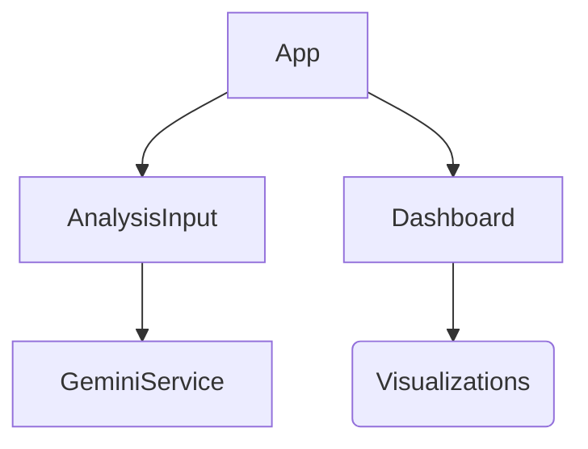

# Architecture Overview

## Design Philosophy

The GenAI Transferability Analyzer is built as a **Client-Side SPA (Single Page Application)**. We made the architectural decision to bypass a traditional backend server for the analysis logic, communicating directly from the browser to the Google Gemini API. 

This reduces latency, simplifies deployment, and leverages the robust security of the `@google/genai` SDK's client-side capabilities (assuming the API key is injected securely via environment variables in the hosting context).

## Component Structure

The application follows a standard React component hierarchy:

### 1. `App.tsx` (Container)
- Manages global state (`report`, `loading`, `error`).
- Orchestrates the data flow between input, service, and display.
- Handles top-level layout and navigation.

### 2. `components/AnalysisInput.tsx`
- Handles Text Area input.
- Handles File Input (PDF).
- Performs basic client-side file reading (FileReader API) to convert PDFs to Base64 strings required by the Gemini API.

### 3. `components/Dashboard.tsx`
- A "dumb" presentation component.
- Receives the fully calculated `FullReport` object.
- Renders visualizations using `recharts` (RadialBar, Pie, Scatter, Radar).
- Displays executive summaries and recommendations.

## State Management

We utilize **React Local State** (`useState`) rather than a global store (Redux/Zustand) because the data flow is strictly unidirectional and shallow:
1. Input -> 
2. Service -> 
3. App State -> 
4. Dashboard Prop.

## Data Flow & Typing

TypeScript is used strictly throughout the application. 
- **`types.ts`**: Defines the contract between the UI and the AI.
- **`RawAnalysisResponse`**: The exact shape returned by the Gemini JSON Schema.
- **`ComputedMetrics`**: Derived data calculated client-side (math is done in JS, not LLM, to ensure deterministic scoring).

## Performance Considerations

- **Asset Loading**: React and Recharts are loaded via CDN (ES Modules) to ensure fast caching.
- **Base64 Handling**: PDF uploads are converted to Base64 in memory. For extremely large files, this might impact browser performance, but for standard Job Description PDFs (1-5MB), this is negligible.
